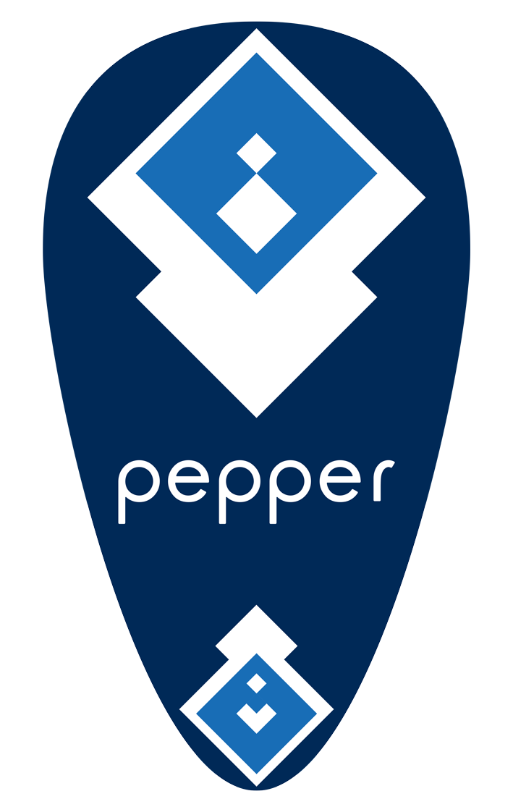

# Proactive Mobility for Pepper (NAOqi 2.5)

With his application, Pepper goes towards people to talk to them, and
returns home when nobody is around, with a choice of three possible
ways to define the home point (Pepper's charging station, a dedicated
ARUCO marker, and Pepper's built in SLAM).

## Documentation

To learn more, see the
[the user guide (pdf)](doc/proactive-mobility-user-guide.pdf).

## ARUCO

Using the ARUCO-based localization system requires printing out a
special marker with precise codes and dimensions; see [this template
(Adobe Illustrator format)](doc/template-aruco-marker.ai).

Here is an example design:

This marker should be printed in linoleum with 2mm thickness max or
as a vinyl sticker
